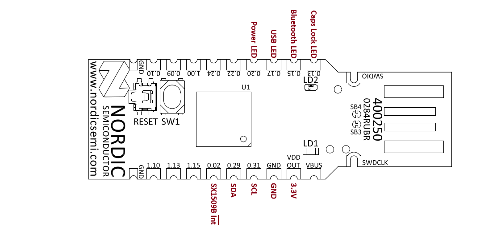

# Elmot's Vintage Keyboard

This project is a Zephyr-based firmware for converting vintage typewriters (like the Brother AX110) into modern USB and
Bluetooth Low Energy (BLE) HID devices.
It uses the Zephyr RTOS to handle USB device stacks, BLE advertising, and input matrix scanning.

## Hardware

Designed to run on boards like the **nrf52840dk**, **nrf52840dongle**, and [**nrf5340dk**](#nrf5340-only).

The following table describes the pinout for each supported board.

### Pinout

| Function          | nRF52840-DK | nRF52840-DONGLE | nRF5340-DK (cpuapp) | Color |
|-------------------|-------------|-----------------|---------------------|-------|
| **I2C SCL**       | **P0.31**   | **P0.31**       | **P1.03**           |       |
| **I2C SDA**       | **P0.30**   | **P0.29**       | **P1.02**           |       |
| **CAPS LOCK LED** | **P0.13**   | **P0.13**       | **P1.14**           | Red   |
| **PWR LED**       | **P1.11**   | **P0.22**       | **P1.10**           | Green |
| **BLE LED**       | **P1.10**   | **P0.15**       | **P1.12**           | Blue  |
| **USB LED**       | **P1.12**   | **P0.17**       | **P1.11**           | Red   |

### Pins reserved for future use:

| Function            | nRF52840-DK | nRF52840-DONGLE | nRF5340-DK (cpuapp) | Color |
|---------------------|-------------|-----------------|---------------------|-------|
| LED 1(not used yet) | P0.14       |                 |                     |       |
| LED 2(not used yet) | P0.15       |                 |                     |       |
| On-module button    |             |                 | P1.06               |       |
| SX1509B interrupt   |             |                 | P0.02               |       |
| LD1                 |             |                 | P0.06               | Green |
| LD2R                |             |                 | P0.08               | Red	  |
| LD2G                |             |                 | P1.09               | Green |
| LD2B                |             |                 | P0.12               | Blue  |

**GPIO extender:** Semtech SX1509B (connected via I2C)

### Key Features

- **Dual Connectivity**: Supports both USB HID and BLE HID.
- **Dynamic Key Mapping**: Translates raw scan codes into standard HID key codes.
- **Modifier Support**: Handles standard modifiers (Shift, Ctrl, Alt) and special function keys.
- **Blue Alt Mode**: A custom function layer activated by a specific key.

## Blue Alt Layer

When the blue **<span style="color:#4682B4">ALT</alt>** key is pressed and held, several keys change their
functionality to provide common modern keyboard features that are missing from the vintage layout.

| Original Key (Nordic layout)                           | Function      | Blue <span style="color:#4682B4">ALT</span> Function | 
|--------------------------------------------------------|---------------|------------------------------------------------------|
| **<span style="color:green">L IND</span>**             | **TAB**       | **ESC**                                              | 
| **<span style="color:green">CODE</span>**              | **Left CTRL** | **Left CTRL**                                        | 
| **1,2 ... 0**                                          | **1,2 ... 0** | **F1 - F10**                                         | 
| Top row **?** ,**`**                                   | **/**, **`**  | **F11, F12**                                         | 
| **RELOC**                                              | **PG UP**     | **HOME**                                             | 
| **INDEX/<span style="color:green">REV</span>**         | **PG DOWN**   | **END**                                              | 
| **W**                                                  | **W**         | **UP**                                               | 
| **A**                                                  | **A**         | **LEFT**                                             | 
| **S**                                                  | **S**         | **DOWN**                                             | 
| **D**                                                  | **D**         | **RIGHT**                                            | 
| **V**                                                  | **V**         | **~**                                                | 
| **WORD OUT/<span style="color:green">LINE OUT</span>** | **ALT**       | **ALT**                                              | 

### Keys Functionality

The key mapping is defined in [`src/ax110keys.c`](src/ax110keys.c). It maps raw 16-bit scan codes to HID key codes.

## Build and Flash

The project is built using the Zephyr build system (west).

```bash
west build -b <board_name>
west flash
```

## nRF52840dongle




## nRF5340 only

### Flashing Network Core

On the nRF5340-DK, you must also flash the network core with the Bluetooth controller firmware.

1. Build the network core image (usually located in a `build_net` directory):
    1. Linux/MacOS
       ```bash
       west build -b nrf5340dk/nrf5340/cpunet -d build_net $ZEPHYR_BASE/samples/bluetooth/hci_ipc
       ```
    2. Windows PowerShell
       ```powershell
       west build -b nrf5340dk/nrf5340/cpunet -d build_net $env:ZEPHYR_BASE/samples/bluetooth/hci_ipc
       ```
2. Flash the network core:
   ```bash
   west flash -d build_net
   ```
